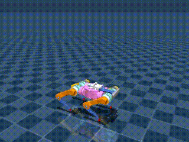

# Reinforcement Learning Development Journal

## Introduction
Welcome to my Reinforcement Learning Development Journal. Here, I document my journey, experiments, and learnings in the field of RL.

### Goals
- Briefly describe your goals or what you aim to achieve with your RL experiments.

### Project Overview
- Provide an overview of your project, including the problem you're trying to solve or the algorithms you're exploring.

---

## Experiment Log

num_minibatches = 4
Time to JIT: 0:00:48.443359. Time to train: 0:16:33.615585.

| num_steps  | eval/episode_reward | eval/episode_reward_std |
|------------|---------------------|-------------------------|
| 0          | 0.5760557           | 0.9477362               |
| 30310400   | 1.806519            | 4.0989275               |
| 60620800   | 8.016773            | 7.0157056               |

---

num_envs=1024
Time to JIT: 0:00:46.034939. Time to train: 0:25:47.985451.

| num_steps  | eval/episode_reward | eval/episode_reward_std |
|------------|---------------------|-------------------------|
| 0          | 0.56519926          | 0.94614327              |
| 30310400   | 8.624402            | 6.6967926               |
| 60620800   | 11.163882           | 6.147504                |

---

https://github.com/andrei-herdt/playground/commit/ff9ffb95f64a821fc80553d6aa9e756ca97ce7db
Increase batch_size
Time to JIT: 0:00:47.062260. Time to train: 0:27:53.307440.

| num_steps  | eval/episode_reward | eval/episode_reward_std |
|------------|---------------------|-------------------------|
| 0          | 0.5935141           | 1.0470779               |
| 32768000   | 7.8386593           | 5.9317703               |
| 65536000   | 9.442217            | 5.8058133               |

---

https://github.com/andrei-herdt/playground/commit/d200d204

Decrease batch_size, increase torque penalty. Time to JIT: 0:00:46.774209. Time to train: 0:25:50.067106.

| num_steps  | eval/episode_reward | eval/episode_reward_std |
|------------|---------------------|-------------------------|
| 0          | 0.587013            | 1.0336502               |
| 30310400   | 6.013794            | 7.0553393               |
| 60620800   | 9.640033            | 9.364621                |

---

https://github.com/andrei-herdt/playground/commit/d24e43d7

Increase feet_air_time. Time to JIT: 0:00:47.117407. Time to train: 0:25:49.084794.

| num_steps  | eval/episode_reward | eval/episode_reward_std |
|------------|---------------------|-------------------------|
| 0          | 0.5909057           | 1.0505813               |
| 30310400   | 3.4921775           | 6.37509                 |
| 60620800   | 13.843228           | 7.590749                |

---

https://github.com/andrei-herdt/playground/commit/70697c88

Increase episode_length. Time to JIT: 0:01:29.635887. Time to train: 0:27:17.197335.

| num_steps  | eval/episode_reward | eval/episode_reward_std |
|------------|---------------------|-------------------------|
| 0          | 0.57269526          | 0.9965664               |
| 30310400   | 30.21885            | 27.981796               |
| 60620800   | 19.369843           | 24.694622               |

---

https://github.com/andrei-herdt/playground/commit/84a2f6a3

Increase torque penalty. Time to JIT: 0:01:29.584691. Time to train: 0:27:17.806234.

| num_steps  | eval/episode_reward | eval/episode_reward_std |
|------------|---------------------|-------------------------|
| 0          | 0.60052776          | 1.0443081               |
| 30310400   | 0.014213366         | 0.013499956             |
| 60620800   | 0.017713964         | 0.020368503             |

---

https://github.com/andrei-herdt/playground/commit/42ee1b36

Decrease torque penalty. Time to JIT: 0:01:28.993436. Time to train: 0:27:16.385898.

| num_steps  | eval/episode_reward | eval/episode_reward_std |
|------------|---------------------|-------------------------|
| 0          | 0.60416865          | 1.0367799               |
| 30310400   | 9.292147            | 19.73348                |
| 60620800   | 31.627762           | 28.004442               |

---

https://github.com/andrei-herdt/playground/commit/de43f5f8

Remove randomisation. Time to JIT: 0:01:27.374001. Time to train: 0:27:12.238757.

| num_steps  | eval/episode_reward | eval/episode_reward_std |
|------------|---------------------|-------------------------|
| 0          | 0.20221572          | 0.32954594              |
| 30310400   | 20.743465           | 28.053604               |
| 60620800   | 21.331964           | 23.62141                |

---

https://github.com/andrei-herdt/playground/commit/eed45565

Increase action rate penalty. Time to JIT: 0:01:25.692798. Time to train: 0:27:07.809092.

| num_steps  | eval/episode_reward | eval/episode_reward_std |
|------------|---------------------|-------------------------|
| 0          | 0.103766695         | 0.21061304              |
| 30310400   | 13.177053           | 21.920616               |
| 60620800   | 12.000593           | 19.584045               |

---

https://github.com/andrei-herdt/playground/commit/8a21018a

Time to JIT: 0:01:26.443080. Time to train: 0:27:10.533919.

| num_steps  | eval/episode_reward | eval/episode_reward_std |
|------------|---------------------|-------------------------|
| 0          | 0.040621825         | 0.097854026             |
| 30310400   | 5.1783323           | 16.438326               |
| 60620800   | 1.5054538           | 7.3795896               |

---

Time to JIT: 0:01:25.823749. Time to train: 0:27:15.119625.

| num_steps  | eval/episode_reward | eval/episode_reward_std |
|------------|---------------------|-------------------------|
| 0          | 1.0489547           | 1.964287                |
| 30310400   | 117.33095           | 120.06268               |
| 60620800   | 157.12668           | 123.28307               |

---

https://github.com/andrei-herdt/playground/commit/816e4453

num_steps:  0
eval/episode_reward:  0.9987528
eval/episode_reward_std:  1.7944983
num_steps:  30310400
eval/episode_reward:  161.31096
eval/episode_reward_std:  138.0662
num_steps:  60620800
eval/episode_reward:  184.12999
eval/episode_reward_std:  119.49414
time to jit: 0:01:25.681162
time to train: 0:27:14.246793

---

https://github.com/andrei-herdt/playground/commit/816e4453

num_steps:  0 eval/episode_reward:  0.0881857 eval/episode_reward_std:  0.11955748
num_steps:  30310400 eval/episode_reward:  26.643467 eval/episode_reward_std:  38.780533
num_steps:  60620800 eval/episode_reward:  39.717873 eval/episode_reward_std:  41.386353
time to jit: 0:01:25.550758

---

num_steps:  0 eval/episode_reward:  0.12857331 eval/episode_reward_std:  0.20599352
num_steps:  30310400 eval/episode_reward:  126.936935 eval/episode_reward_std:  103.64848
num_steps:  60620800 eval/episode_reward:  108.58201 eval/episode_reward_std:  97.783
time to jit: 0:01:26.454457 time to train: 0:26:44.189723
